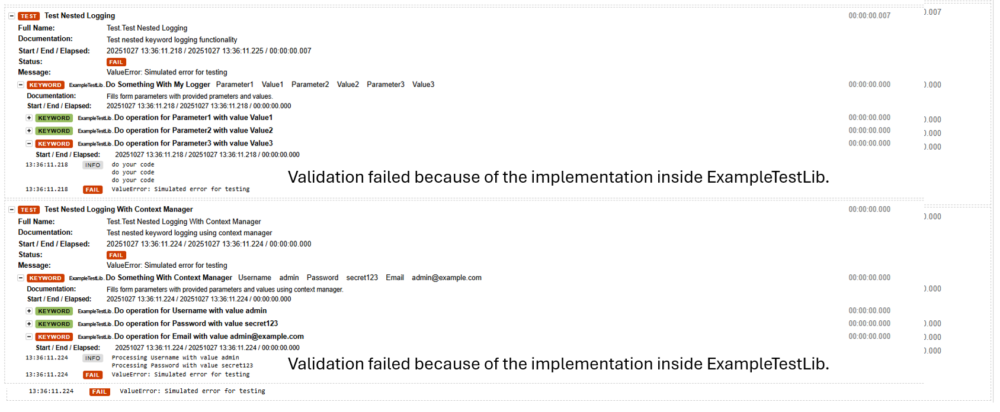

# robotframework-NestedLogger

The goal of this library is to enable the registration of keywords so that they are visible at the HTML level as individual keywords, while their implementation is nested in python.

## Description

The `NestedLogger` library allows Robot Framework test libraries to dynamically log keywords during test execution. This is particularly useful when you want to break down complex operations into smaller inside of python

## Example Output

Here's how nested keywords appear in the Robot Framework log report:



Each nested operation is logged as a separate keyword with its own pass/fail status, making it easy to trace execution and identify issues.

## Installation

### Install from source

```bash
pip install .
```

### Install in development mode

```bash
pip install -e .
```

### Install from PyPI (when published)

```bash
pip install robotframework-nestedlogger
```

## Usage

### Basic Example (Traditional Way)

```python
from NestedLogger import NestedLogger
from robot.api.deco import keyword

class MyLibrary:
        
    @keyword("Process Multiple Items")
    def process_items(self, *params_and_values):
        """ Fills form parameters with provided parameters and values.

        *Arguments:*
        | =Name= | =Description= | =Example value= |
        | params_and_values | Alternating parameter names and values | "Full Name"    "Artur Ziolkowski" |

        *Return*
        | String | Done |
        """
        my_logger = NestedLogger()

        lib_name = self.__class__.__name__
        for param, value in zip(params_and_values[::2], params_and_values[1::2]):
            kw_name = "Do operation for {param} with value {value}".format(param=param, value=value)
            my_logger.start_keyword(kw_name, lib_name)

            status = 'PASS'
            error = None
            try:
                print("do your code")
            except Exception as e:
                status = 'FAIL'
                error = e
            finally:
                my_logger.end_keyword(kw_name, lib_name, status)
                if error:
                    raise error

        return "Done"

    def _process_single_item(self, item):
        # Implementation
        print(f"Processing: {item}")
```

### Using Context Manager (Recommended)

The `NestedLogger` class supports Python's context manager protocol, which provides cleaner code and automatic error handling:

```python
from NestedLogger import NestedLogger
from robot.api.deco import keyword

class MyLibrary:
        
    @keyword("Process Multiple Items")
    def process_items(self, *params_and_values):
        """ Fills form parameters with provided parameters and values using context manager.

        *Arguments:*
        | =Name= | =Description= | =Example value= |
        | params_and_values | Alternating parameter names and values | "Full Name"    "Artur Ziolkowski" |

        *Return*
        | String | Done |
        """
        lib_name = self.__class__.__name__
        
        for param, value in zip(params_and_values[::2], params_and_values[1::2]):
            kw_name = "Do operation for {param} with value {value}".format(param=param, value=value)
            
            # Context manager automatically handles start/end and error status
            with NestedLogger(kw_name, lib_name, 'PASS'):
                print(f"Processing {param} with value {value}")
                # Your code here - if exception occurs, status will be automatically set to FAIL
                self._process_single_item(param, value)
                
        return "Done"

    def _process_single_item(self, param, value):
        # Implementation
        print(f"Processing parameter '{param}' with value '{value}'")
```

### In Robot Framework Test

```robotframework
*** Settings ***
Library    MyLibrary

*** Test Cases ***
Test Processing
    Process Multiple Items    item1    item2    item3
```

Each item will appear as a separate keyword in the log.html report with its own pass/fail status.

## API

### NestedLogger Class

#### Constructor: `__init__(kwname=None, libname=None, status='PASS')`
Creates a new NestedLogger instance.

**Arguments:**
- `kwname` (str, optional): Name of the keyword to log (required for context manager usage)
- `libname` (str, optional): Name of the library owning the keyword (required for context manager usage)
- `status` (str, optional): Expected status for successful execution (default: 'PASS')

**Example:**
```python
# For traditional usage
logger = NestedLogger()

# For context manager usage
with NestedLogger('My Keyword', 'MyLibrary', 'PASS'):
    # Your code here
    pass
```

#### `start_keyword(kwname, libname, status='FAIL')`
Starts logging a new nested keyword.

**Arguments:**
- `kwname` (str): Name of the keyword to log
- `libname` (str): Name of the library owning the keyword
- `status` (str): Initial status (default: 'FAIL')

**Example:**
```python
logger = NestedLogger()
logger.start_keyword('Process Item', 'MyLibrary')
```

#### `end_keyword(kwname, libname, status)`
Ends logging of a nested keyword.

**Arguments:**
- `kwname` (str): Name of the keyword to log
- `libname` (str): Name of the library owning the keyword
- `status` (str): Final status ('PASS' or 'FAIL')

**Example:**
```python
logger.end_keyword('Process Item', 'MyLibrary', 'PASS')
```

#### Context Manager Protocol
The `NestedLogger` class implements `__enter__` and `__exit__` methods, allowing it to be used with Python's `with` statement.

**Benefits:**
- Automatic keyword start and end
- Automatic error handling (sets status to 'FAIL' on exception)
- Cleaner, more readable code
- Ensures `end_keyword` is always called

**Example:**
```python
with NestedLogger('My Operation', 'MyLibrary', 'PASS'):
    # Keyword automatically started
    do_something()
    # Keyword automatically ended with status 'PASS'
    # If exception occurs, status is automatically set to 'FAIL'
```

## Requirements

- Python >= 3.10
- robotframework >= 7.3.0

## License

This project is licensed under the Apache License 2.0 - see the [LICENSE](LICENSE) file for details.
